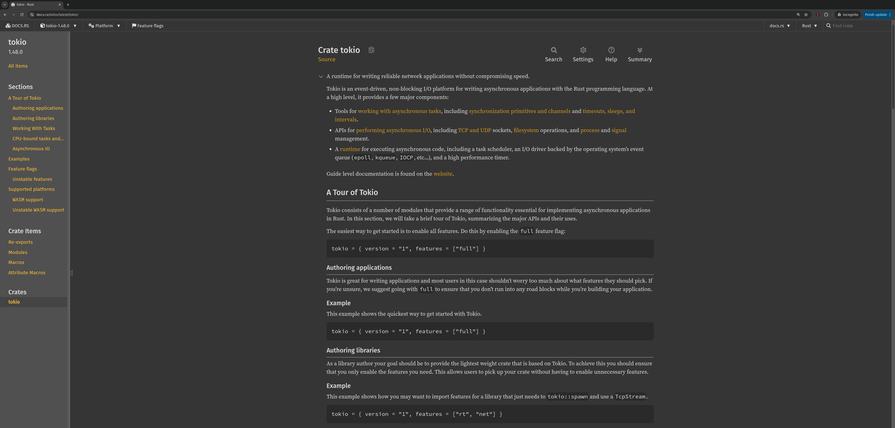

# center_docs_rs

A very simple chrome extension to center the text in docs.rs.

> There is probably a better way to do this, but I couldn't find it in 5 minutes.

## Screenshots

### Before

### After

## Installation

### Chome Web Store

tba

### Manual

Clone the repository and load the folder as an unpacked extension in Chrome.

## Contributing

If you find a bug or have a feature request, please open an issue or submit a pull request.
